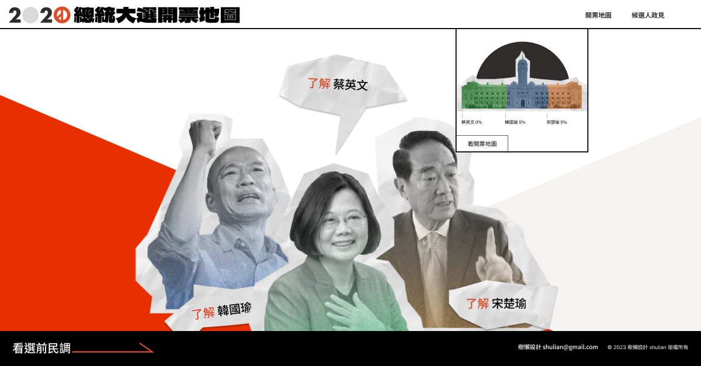

# 2023 THE F2E Mission 2 - Presidential Voting Map

## 📙 Introduction

This ia a Presidential Voting Map, allowing users to understand polling information across regions through charts.



## 👉 Demo

[2020 總統大選開票地圖](https://president-invoice.vercel.app/)

## 🎨 Designer

[wala](https://2023.thef2e.com/users/12061579704049918951)

## 🔧 Environment

- node version: `v18.14.1`
- pnpm version: `v8.2.0`

## ⚡ Usage

### 🔌 Installation

```
pnpm install
```

### 📦 Commands

```
pnpm start
```

### 📁 Folder Structure

```

    .
    ├── ...
    ├── app
    │   ├── pages        # page component
    │   │     ├── shell      # child route
    │   │     ├── features   # container component
    │   │     └── ui         # presentational component
    │   │
    │   ├── style        # scss variable、global style
    │   ├── shell        # layout
    │   ├── shared
    |   └── .. ├── ui        # shared component
    └── ...    └── domain
                      ├── configs  # configs
                      ├── models   # data interface
                      ├── services # api services
                      ├── store    # global store
                      └── utils    # utils function


```

### 🔩 Built with

- nrwl nx
- angular v17
- angular material
- d3.js
- topojson client
- gsap

### 📊 Data resource

- [中選會](https://db.cec.gov.tw/ElecTable/Election?type=President)
- [內政地理資訊圖資雲整合服務平台](https://www.tgos.tw/tgos/NgdaMap)

`Note: Using QGIS to recreate a GeoJson`
